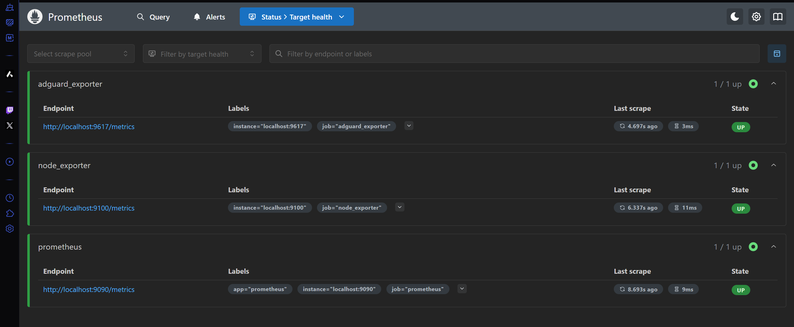
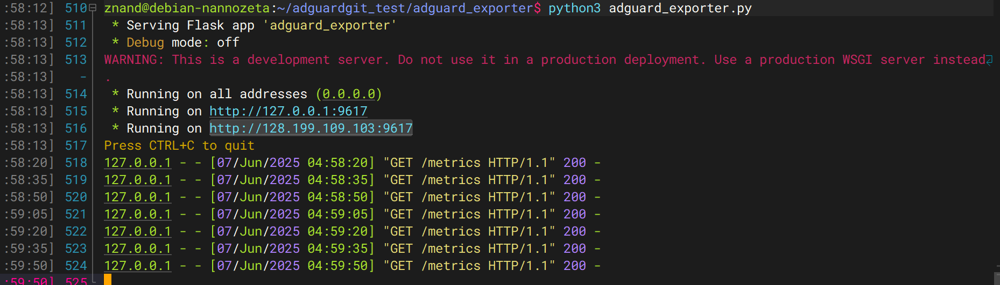

# 💡AdGuard Exporter



Exporter Prometheus untuk mengambil statistik dari AdGuard Home dengan menggunakan Rest API dari AdGuard
### Clone repo:
```
git clone https://github.com/znand-dev/adguard_exporter.git
cd adguard_exporter
```
### ⚠️ Requirements:
``` 
sudo apt update
```
> Jika terkena proteksi PEP 688
```
python3 -m venv venv 
source venv/bin/activate
```
```
pip install -r requirements.txt
```

### ✅Cara pakai:

1. Salin .exampe.env ke .env kemudian isi sesuai dengan kredential dari AdGuard.
```
sudo cp .env.example .env
sudo nano .env
```

2. Jalankan script: `python3 adguard_exporter.py` dan akses http://localhost:9617/metrics untuk test. 



Jika log menampilkan => ```"GET /metrics HTTP/1.1" 200 -``` ,maka script berjalan normal.

3. Gunakan systemd service: `adguard_exporter.service`, jangan lupa update path workdir nya. 
```
sudo cp adguard_exporter.service /etc/systemd/system/
sudo systemctl daemon-reexec
sudo systemctl enable --now adguard_exporter
sudo systemctl start adguard_exporter
```

Periksa service running atau tidak:
```
sudo systemctl status adguard_exporter
```

4. Tambahkan di prometheus.yml agar bisa discrape Prometheus.

```
scrape_configs:
  - job_name: 'adguard_exporter'
    static_configs:
      - targets: ['localhost:9617']
``` 
5. Restart prometheus dan akses http://localhost:9090/targets, cek kembali apakah sudah up.
6. Tambahkan kembali datasource prometheus di web ui grafana kemudian gunakan grafana. 

Kali aja ada orang baik yang mau support hehe :)
ETH (ERC-20): ```0x561fa822553e78b25be69e194d271aed5dd202e6```


